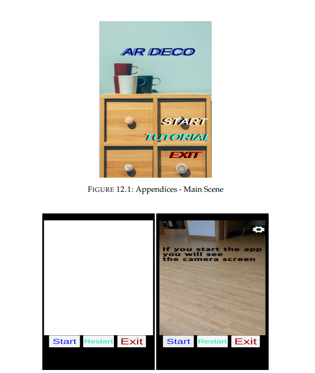
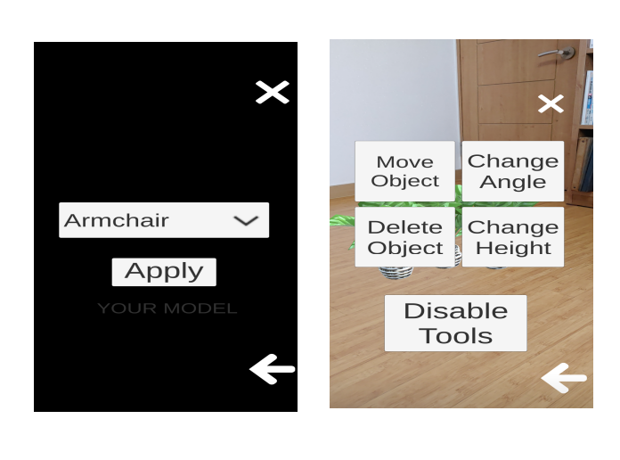
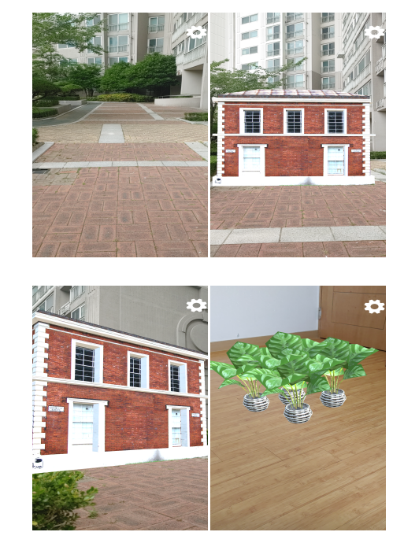

# 🌟 AR DECO App
**증강현실(AR) 기반 인테리어 디자인 앱**  
*(BSc Computer Science 졸업 프로젝트, 2020–2021)*  

  
  
  

---

## 📱 개요
**AR DECO**는 사용자가 **3D 증강현실(AR)** 기술을 통해 실제 공간을 직접 디자인하고 시각화할 수 있는 안드로이드 애플리케이션입니다.  
가구와 인테리어 아이템을 스마트폰 카메라 화면 위에 배치·이동·회전·크기 조절하여 **구매 전 실제 배치 모습을 미리 확인**할 수 있습니다.

> 🎯 **목표:** 가구와 인테리어를 온라인으로 구매하기 전에 실시간 AR 미리보기를 통해 **노력과 비용을 최소화**합니다.

---

## ✨ 주요 기능
- 🏡 **실시간 AR 시각화** – ARCore를 활용하여 실제 방 안에 3D 가구 모델 배치
- 🎯 **직관적인 오브젝트 제어** – 터치 제스처만으로 이동, 회전, 높이 조절, 삭제
- 🎨 **다양한 레이아웃 실험** – 색상·배치·가구 조합 자유롭게 변경
- 📚 **내장 튜토리얼** – 처음 사용자도 쉽게 익힐 수 있도록 영상 가이드 제공
- 💡 **오프라인 실행 가능** – 설치 후 인터넷 연결 없이도 사용 가능

---

## 🛠️ 기술 스택 & 개발 도구
| 구분               | 사용 기술 / 도구                                                        |
|--------------------|---------------------------------------------------------------------------|
| **개발 플랫폼**     | Unity Engine, Android Studio                                             |
| **프로그래밍 언어** | C# (Unity 스크립팅), Java (Android)                                      |
| **AR 프레임워크**   | Google ARCore (AR Camera, Anchors, Placement Indicator)                  |
| **개발 환경**       | Unity Asset Store, Unity Package Manager, Android Virtual Device (AVD)   |
| **테스트**         | ARCore 지원 안드로이드 기기 및 Android Emulator                           |

---

## ⚙️ 시스템 아키텍처
앱은 **Unity 씬 기반 구조**로 설계되었습니다.
- **Main Scene:** 시작/튜토리얼/종료 버튼 제공
- **Tutorial Scene:** 사용 방법을 안내하는 동영상 페이지
- **AR Scene:** 3D 오브젝트 배치 및 조작 핵심 기능
  - **Settings Menu** → Tools(이동/삭제/회전/높이 조절) & Object Menu(3D 모델 선택/적용)
  - **Placement Indicator** → 실제 공간에서 정확한 배치 위치 표시

---

## 🔑 구현 포인트
- **Unity AR Foundation** + **Google ARCore XR Plugin**을 통합하여 안정적인 3D 오브젝트 앵커링 구현
- **C#**으로 터치 감지 및 오브젝트 조작 스크립트 직접 개발
- **Unity Canvas**를 활용한 반응형 UI 설계 및 인터랙션 구현
- Android **APK** 추출 및 실제 기기/에뮬레이터 테스트 완료

---

## 🧪 테스트 & 평가
- **사용자 테스트:** ARCore 지원 안드로이드 기기 10대에서 실시
- **피드백 결과:**
  - ✅ AR 배치 및 UI 정상 동작 확인
  - 🔧 초반 테스트에서 일부 오브젝트 이동 문제 발견 → **튜토리얼 씬 추가** 및 조작 코드 개선
- **결과:** 반복 개선을 통해 **사용성이 높은 인터랙티브 AR 디자인 경험** 제공

---

## 🚀 설치 방법
1. 저장소에서 **[`ARDeco.apk`](./ARDeco.apk)** 파일을 다운로드합니다.  
2. 안드로이드 기기로 APK 파일을 복사합니다.  
3. 기기 설정에서 **알 수 없는 소스 허용**을 활성화합니다.  
4. 앱을 설치 후 실행합니다. *(ARCore 지원 기기 필요)*

---

## 🖼️ 데모 & 스크린샷
아래 이미지는 예시이며, 실제 앱 화면 캡처로 교체하세요.

| 메인 화면 | AR 화면 | 오브젝트 배치 |
|-----------|---------|--------------|
|  |  |  |

> 🖼️ **팁:** `docs/images` 폴더를 생성 후 실제 스크린샷 파일(`.png`/`.jpg`)을 업로드하세요.

---

## 📈 시연을 통해 입증한 역량
- **모바일 풀스택 개발** – 설계부터 구현, 테스트, 배포까지 전 과정 수행
- **증강현실 엔지니어링** – ARCore 통합, 3D 오브젝트 렌더링, 실시간 카메라 트래킹
- **크로스 플랫폼 개발** – Unity + Android Studio를 활용한 APK 패키징 및 AVD 테스트
- **사용자 중심 설계** – 설문조사, 사용자 테스트, 반복 개선을 통한 UX 향상

---

## 🧭 향후 개선 계획
- 온라인 가구 카탈로그에서 **사용자 맞춤 3D 모델 가져오기** 기능
- **클라우드 저장**을 통한 기기 간 동기화
- iOS 확장을 위한 **ARKit 지원** 추가

---

## 👨‍💻 개발자
**찬호 김 (Chanho Kim)**  
- University of London BSc Computer Science 졸업  
- 현실과 디지털을 잇는 몰입형 애플리케이션 개발에 열정을 가진 개발자  
- [LinkedIn](https://www.linkedin.com/) • [GitHub](https://github.com/)

---

## 📜 라이선스
이 프로젝트는 교육 및 포트폴리오 목적으로 제작되었습니다. © 2021 Chanho Kim

     

# 🌟 AR DECO App
**An Augmented Reality Home Design Application**  
*(BSc Computer Science Final Year Project, 2020–2021)*  

  
  
  

---

## 📱 Overview
**AR DECO** is an Android application that lets users **visualize and design real-world spaces** using **3D Augmented Reality (AR)** technology.  
With AR DECO, you can place, move, rotate, and resize virtual furniture and décor items in your actual environment—seeing exactly how your design choices will look **before making a purchase**.

> 🎯 **Goal:** Help users design their rooms with minimum effort and expense by previewing furniture in real-time AR.

---

## ✨ Key Features
- 🏡 **Real-Time AR Visualization** – Place 3D furniture models in your actual room using ARCore.
- 🎯 **Interactive Object Control** – Move, rotate, change height, or delete objects with intuitive touch gestures.
- 🎨 **Customizable Design Layouts** – Experiment with different arrangements and décor styles.
- 📚 **Built-in Tutorial Scene** – Onboarding guide to help first-time users quickly learn the interface.
- 💡 **Offline Functionality** – Works entirely on-device once installed.

---

## 🛠️ Tech Stack & Tools
| Category            | Technology / Tool                                                     |
|----------------------|------------------------------------------------------------------------|
| **Platform**         | Unity Engine, Android Studio                                          |
| **Languages**        | C# (Unity scripting), Java (Android)                                  |
| **AR Framework**     | Google ARCore (AR Camera, Anchors, Placement Indicator)               |
| **Development Tools**| Unity Asset Store, Unity Package Manager, Android Virtual Device (AVD) |
| **Testing**          | ARCore-supported Android devices + Android Emulator                   |

---

## ⚙️ System Architecture
The app follows a **scene-based architecture** implemented in Unity:
- **Main Scene:** Entry point with Start, Tutorial, and Exit options.
- **Tutorial Scene:** Guided video instructions for new users.
- **AR Scene:** Core functionality for placing and manipulating 3D AR objects.
  - **Settings Menu** → Tools (move/delete/rotate/height) & Object Menu (select and apply 3D models).
  - **Placement Indicator** → Ensures precise object placement in real-world space.

---

## 🔑 Implementation Highlights
- Integrated **Unity AR Foundation** and **Google ARCore XR Plugin** for robust 3D object anchoring.
- Developed custom **touch detection** and **object manipulation** scripts in **C#**.
- Designed a modular UI with **Unity Canvas**, supporting responsive layouts and interactive buttons.
- Extracted the Android **APK** for deployment and user testing.

---

## 🧪 Testing & Evaluation
- **User Testing:** Conducted on **10 ARCore-supported Android devices**.
- **Feedback:**
  - ✅ Smooth AR placement and functional UI confirmed.
  - 🔧 Early tests revealed object-movement challenges → **added a tutorial scene** and improved controls in second implementation.
- **Outcome:** Delivered a **highly interactive, user-friendly AR design experience** after iterative improvements.

---

## 🚀 Installation
1. Download the **[`ARDeco.apk`](./ARDeco.apk)** file from the repository (or Releases page).
2. Transfer it to your Android device.
3. Enable **Install from Unknown Sources** in device settings.
4. Install and launch the app. *(ARCore-supported device required)*

---

## 🖼️ Demo & Screenshots
Replace the placeholder images below with real screenshots of your app for the GitHub page.

| Main Scene | AR Scene | Object Placement |
|------------|----------|------------------|
|  |  |  |

> 🖼️ **Tip:** Create a `docs/images` folder in your repo and upload actual PNG/JPG screenshots with these filenames.

---

## 📈 Skills Demonstrated
- **Full-Stack Mobile Development** – End-to-end design, implementation, testing, and deployment.
- **Augmented Reality Engineering** – ARCore integration, 3D object rendering, and real-time camera tracking.
- **Cross-Platform Development** – Unity + Android Studio workflow with APK packaging and AVD testing.
- **User-Centered Design** – Online surveys, user testing, and iterative refinement for enhanced usability.

---

## 🧭 Future Improvements
- Allow importing **custom 3D furniture models** from online catalogs.
- Implement **cloud object storage** for cross-device syncing.
- Expand to **iOS** with ARKit support.

---

## 👨‍💻 Author
**Chanho Kim**  
- BSc Computer Science, University of London  
- Passionate about creating modern, immersive applications that bridge the digital and physical worlds.  
- [LinkedIn](https://www.linkedin.com/) • [GitHub](https://github.com/)

---

## 📜 License
This project is for educational and portfolio purposes. © 2021 Chanho Kim.

